# Shield 2018 Docker Tutorial

This is a step-by-step tutorial for troubleshooting an example
alignment. On the docker image, the atlas images can be found in
the directory, "/allen-mouse-brain-atlas" and the example images can be found
in /tutorial/images. The tutorial has three parts - preparing the image for 
automatic alignment, running the automatic alignment and fine tuning the 
alignment.

## Starting the Docker image
The tutorial assumes you have Docker installed on your system and available
from the command line. Installation instructions can be found at the
[docker website](https://docs.docker.com/install/).

The Shield 2018 docker image can be downloaded using the command:
```commandline
$ docker pull chunglabmit/shield-2018
```

The tutorial assumes you are running the shield-2018 docker container
interactively. You can run the container like this:

```commandline
docker run -it -p 9100:9100 --network host chunglabmit/shield-2018
```

The docker container will run interactively, with port forwarding of port 9100
to the local host.

In the tutorial, we save intermediate results to "~/tutorial". You should
create that directory in your docker container (type the following without the
"#" key):
```commandline
# mkdir ~/tutorial
```

## Preparing the image for alignment
The first step is to downsample the image data into a 3D tif that is roughly 
aligned with the reference image. The axes must match and the data may need to
be cropped to match the reference image. Downsampling is done with the
[rescale-image-for-alignment](https://github.com/chunglabmit/nuggt/blob/master/README.md#rescale-image-for-alignment)
tool and display is done using
[nuggt-display](https://github.com/chunglabmit/nuggt/blob/master/README.md#nuggt-display).

First, open the reference image. Several reference images are included in the
atlas directory including images with and without olfactory bulbs. You should
use the one that looks most like your sample. In this tutorial, we will use
/allen-brain-mouse-atlas/autofluorescence_25_half_sagittal.tif. To display,
 type (all one line, but not the "#" character):

```commandline

# nuggt-display --port 9100 \
    /allen-mouse-brain-atlas/autofluorescence_25_half_sagittal.tif image gray
```

A link should appear at the bottom of your terminal. Click the link and you should see something like
this:

Now we are going to prepare the downsampled image to look like this one. The 
images will be downsampled to the size of the atlas image which is why we need
to input the atlas image in the rescale command. First, type ctrl-c in the
terminal to terminate nuggt-display.

The original files are organized as a “stack” of 2D images in the
“/tutorial/images/Color_1” directory. The following command shows some of them:
```commandline
$ ls /tutorial/images/Color_1 | head
```

You can see that the images have names like “img_0000.tif”. These have a “glob” 
expression of `img_*.tif`  that will collect them all. So, when rescaling the
image for alignment, we use the path, `/tutorial/images/img_*.tif`. The full
command looks like this:
```commandline
# rescale-image-for-alignment \
    --input "/tutorial/images/Color_1/img_*.tif" \
    --output ~/tutorial/rescaled-image-1.tif \
    --atlas-file /allen-mouse-brain-atlas/autofluorescence_25_half_sagittal.tif
```
Let's look at the file:
```commandline
# nuggt-display --port 9100 ~/tutorial/rescaled-image-1.tif image gray
```
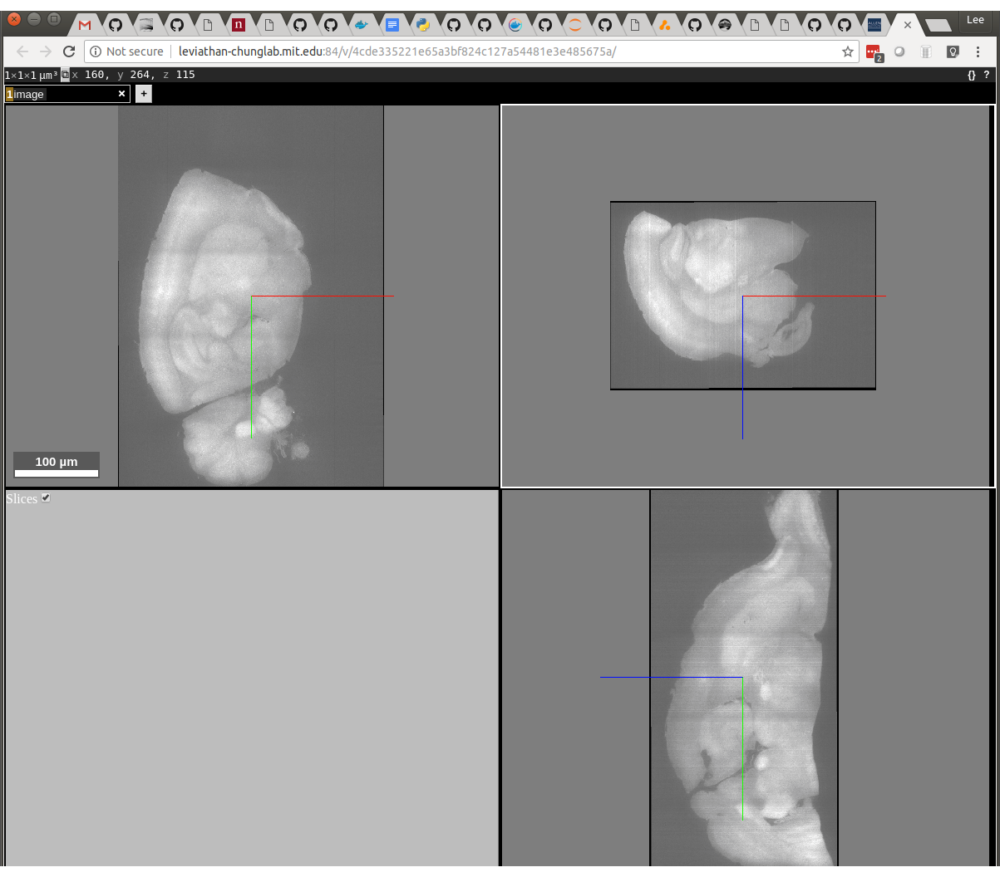

The left-top window of Neuroglancer displays X/Y, the right-top window displays
X/Z and the bottom right window displays Y/Z. You can see that the X/Z window
is upside down and flipped right to left when compared with the reference:

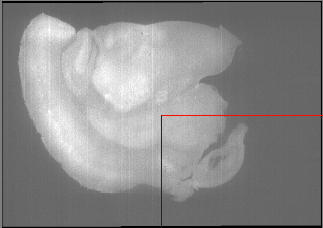 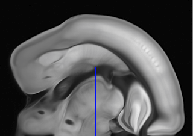

So we have to flip in X and Z using the --flip-x and --flip-z switches:
```commandline
# rescale-image-for-alignment \
    --input "/tutorial/images/Color_1/img_*.tif" \
    --output ~/tutorial/rescaled-image-1-flip-x-flip-z.tif \
    --atlas-file /allen-mouse-brain-atlas/autofluorescence_25_half_sagittal.tif \
    --flip-x --flip-z
```

Then use nuggt-display to display the result:
```commandline
# nuggt-display --port 9100 \
    ~/tutorial/rescaled-image-1-flip-x-flip-z.tif image gray
```

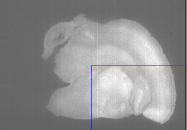

That looks almost right. There's some empty space to the left. This will cause
problems in the next step because the images don't quite overlay each other.
We'll fix this in the next step.

## Automatic alignment
Automatic alignment is done using the command, 
[sitk-align](https://github.com/chunglabmit/nuggt/blob/master/README.md#sitk-align).
In this example, we try aligning to the image, 
"rescaled-image-flip-x-flip-z.tif". (in the interest of time, you may want to
skip this step because it fails). The --moving-file is the image to be aligned.
The --fixed-file is the reference image. The --fixed-point-file is a set of
reference points that were placed on the --fixed-file
(you can create this file yourself using nuggt).
```commandline
# sitk-align \
    --moving-file ~/tutorial/rescaled-image-1-flip-x-flip-z.tif \
    --fixed-file /allen-mouse-brain-atlas/autofluorescence_25_half_sagittal.tif \
    --fixed-point-file /allen-mouse-brain-atlas/coords_25_half_sagittal.json \
    --alignment-point-file ~/tutorial/initial-alignment.json \
    --xyz
```

If you run this, it takes a long time and fails with the error message:
```text
itk::ExceptionObject (0x2b375b0)
Location: "ElastixTemplate - Run()" 
File: /build/Elastix/Common/CostFunctions/itkAdvancedImageToImageMetric.hxx
Line: 1066
Description: itk::ERROR: AdvancedMattesMutualInformationMetric(0x2b11150): Too many samples map outside moving image buffer: 468 / 2048


Error occurred during actual registration.


Traceback (most recent call last):
  File "/usr/local/bin/sitk-align", line 11, in <module>
    load_entry_point('nuggt', 'console_scripts', 'sitk-align')()
  File "/app/nuggt/sitk_align.py", line 204, in main
    args.transform_parameters_folder)
  File "/app/nuggt/sitk_align.py", line 119, in align
    selx.Execute()
  File "/usr/local/lib/python3.6/dist-packages/SimpleITK/SimpleITK.py", line 10132, in Execute
    return _SimpleITK.ElastixImageFilter_Execute(self)
RuntimeError: Exception thrown in SimpleITK ElastixImageFilter_Execute: /SimpleElastix/Code/Elastix/src/sitkElastixImageFilterImpl.cxx:259:
sitk::ERROR: 
itk::ExceptionObject (0x2b363a0)
Location: "unknown" 
File: /build/Elastix/Core/Main/elxElastixFilter.hxx
Line: 253
Description: itk::ERROR: Self(0x1ff4550): Internal elastix error: See elastix log (use LogToConsoleOn() or LogToFileOn()).
```


This error is almost always caused by a downsampled image that does not match 
the reference closely enough. In this case, we can fix this by cropping the
downsampled image in the X direction. The x-axis is flipped, so this blank space
is really at the right side of the image. For a small image like this one, we
can examine the whole image at once using the command:
```commandline
# nuggt-display --port 9100 "/tutorial/images/Color_1/img_*.tif" image gray
```

For a larger image, you might examine a small part of it by looking at only a 
portion of the stack (in this case img_0100.tif to img_0199.tif):
```commandline
# nuggt-display --port 9100 "/tutorial/images/Color_1/img_010*.tif" image gray
```
We can use the neuroglancer cursor to find the x-coordinate of the blank space:
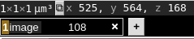
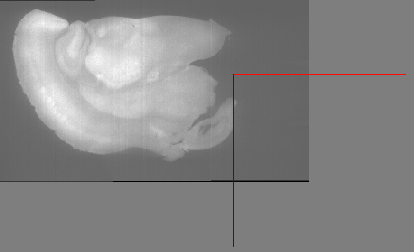

You can see that the X coordinate is 525, so we will use that to clip. 
The "--clip-x 0,525" argument clips in the X direction, reducing the image to 
the region from 0 to 525:
```commandline
# rescale-image-for-alignment \
    --input "/tutorial/images/Color_1/img_*.tif" \
    --output ~/tutorial/rescaled-image-1-flip-x-flip-z-clip-x-0-525.tif \
    --atlas-file /allen-mouse-brain-atlas/autofluorescence_25_half_sagittal.tif \
    --flip-x --flip-z --clip-x 0,525
```

We can run sitk-align with the new file:
```commandline
# sitk-align \
    --moving-file ~/tutorial/rescaled-image-1-flip-x-flip-z-clip-x-0-525.tif \
    --fixed-file /allen-mouse-brain-atlas/autofluorescence_25_half_sagittal.tif \
    --fixed-point-file /allen-mouse-brain-atlas/coords_25_half_sagittal.json \
    --alignment-point-file ~/tutorial/initial-alignment.json --xyz
```

This command should complete and create a good alignment in the file, 
"~/initial_alignment.json". It takes ~15 minutes or so to run.

## Adjusting the alignment manually
sitk-align performs a non-rigid registration when it aligns. This means that it
bends and warps the moving image to conform to the fixed one. It uses brightness
cues to do this, but usually, there will be areas where it has done a less than
perfect job. 
[nuggt-align](https://github.com/chunglabmit/nuggt/blob/master/README.md#) 
can be used to refine the alignment.

First, copy the "initial-alignment.json" file to "alignment.json". This file 
will be overwritten by nuggt-align as you refine the alignment:

```commandline
# cp ~/tutorial/initial-alignment.json ~/tutorial/alignment.json
```

Then run nuggt-align:
```commandline
# nuggt-align \
     --port 9100 \
     --reference-image /allen-mouse-brain-atlas/autofluorescence_25_half_sagittal.tif \
     --moving-image ~/tutorial/rescaled-image-1-flip-x-flip-z-clip-x-0-525.tif \
     --points ~/tutorial/alignment.json
```

Unlike other nuggt commands, nuggt-align prints two URLs:
Reference viewer: http://127.0.0.1:9100/v/.../
Moving viewer: http://127.0.0.1:9100/v/.../

The reference viewer shows the alignment points in the frame of reference of 
the atlas image. The moving viewer shows the alignment points in the frame of 
reference of your sample image.
Neuroglancer has a help function that you can bring up by clicking on the
browser display and pressing "H". You should see something like this:

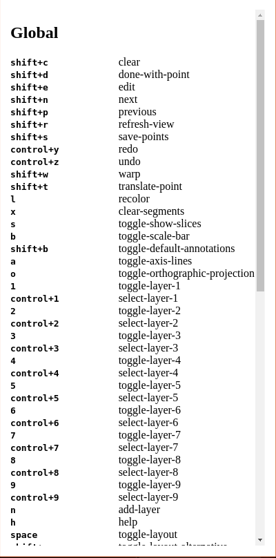

You can type the "escape" key to get back to the original display. The top 11 
commands are specific to nuggt-align so we will be highlighting those. First of
all, we want to see the sample image overlaid on top of the reference, to see
how good our alignment is. To do this, hold down the Shift key
and type "w" = "shift-w". Note that on the bottom it says, "Warping alignment
image to reference - patience please". **It's very important to do nothing
until this message changes.** After it's done, you should see something like
this:

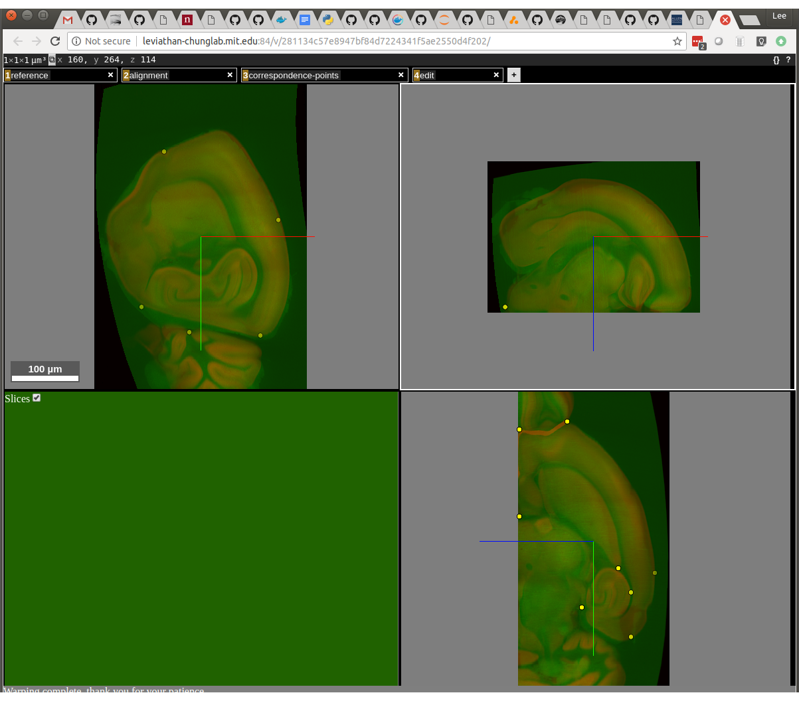

The sample image is green and the reference image is red. You can see that they
are somewhat aligned, but some areas need to be refined. The first task is to
review the placement of the existing points. This is done with the "shift-N"
(next) and "shift-P" keys. Press shift and N to edit the first point. It's
best to have the two windows side-by-side like this:

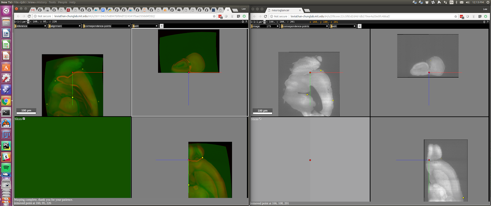

You can see the red dot in the left image corresponds pretty closely to the red
dot in the right image, in all three panes. If you think it doesn't, you can go
to the right window and move it by pressing the "ctrl" key at the same time as
the left mouse button at the spot where you think it should be. You can move to
the next point by pressing "shift + N" and it will complete your edit of the
previous point as it moves to the next one. If you want to just complete the
edit without moving to the next point, press "shift + D" (done editing). Cycle
through all the points now, editing each in turn using "shift + N" (or
"shift + P" to go backwards).

You can toggle display of the reference or moving image by clicking on the
number, "1" or "2" in the window:

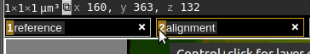

When you are done editing the existing points, press "shift + W" to rewarp the 
image to the reference (and wait until it's done!).

You can add additional points to further refine the alignment. To do this, go
to the window on the left and press "ctrl + left mouse button". A red dot
should appear under your cursor. Then type "shift+t" (translate-point). A red
dot will appear in the window on the right in the corresponding location 
for the current alignment (which is wrong because you're trying to correct it!):

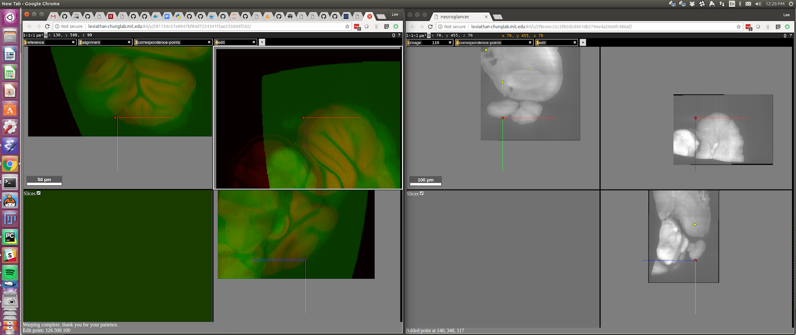

You can then correct the alignment and type "shift + D" to complete the edit.

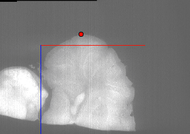

After you are satisfied with the alignment, type "shift + S" to save. 
The file, "~/tutorial/alignment.json" will be updated with the corrected
alignment.